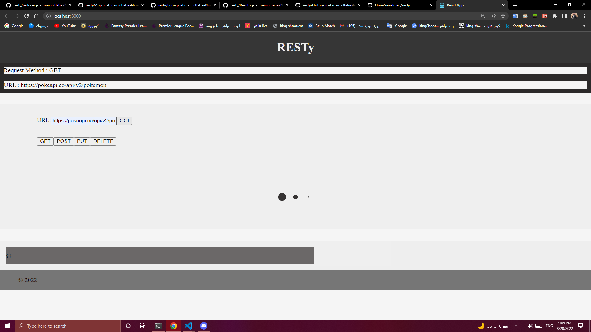

# **RESTy**

---

# **Deploy**
[RESTy - netlify](https://resty-fullversion-omar.netlify.app/)

---

## **RESTy API testing application**
Build a simple web application using **REACT JS** and style it with **Saas** to rander a route and show data on the home page.

## **BY**
- UseState
- axios
- UseEffect
- JSONPretty
- Test React
- UseReducer
- Animation css for **Loading data**

## **Summary of work:**
- ### **Loading to Fetch Data From API**
   

- ### **Fetch Data From API**
   

- ### **To Add or update the json data When click on PUT or POST Routes**
   

## **UML Diagram**

